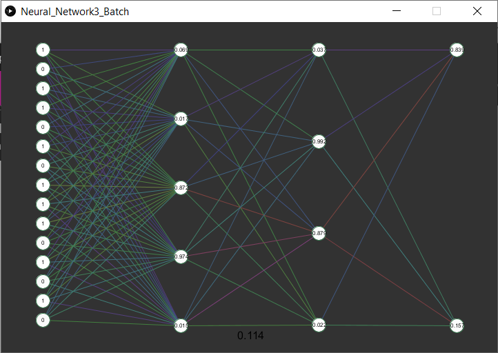

# Neural-Network-Visualisation
A visualisation of the neural network structure and it's running process

This is a Processing project which is intended to show individuals how a neural network works through visualising the changing weights depending on inputs and how the overall loss decreases over a training process. It was made in Processing's python version and is compiled to run on Windows, Mac and Linux. All the relevant files are found in the first folder.
